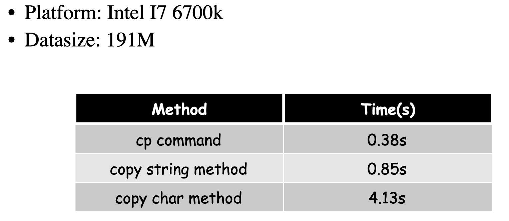
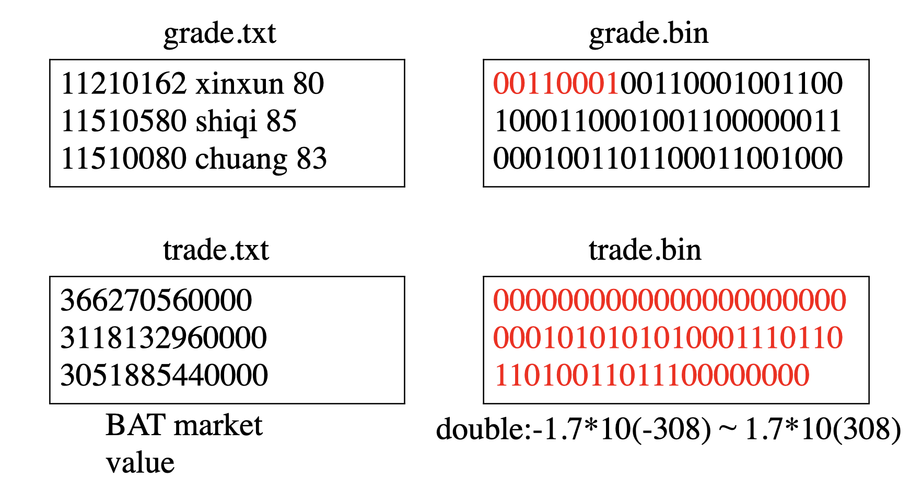
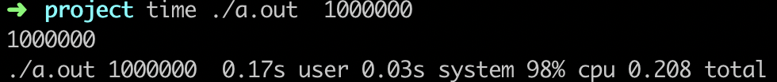
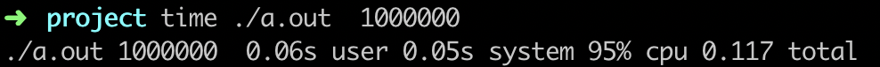
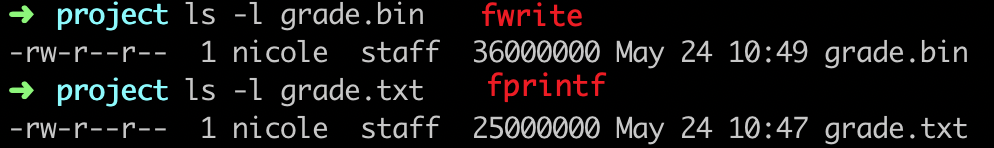
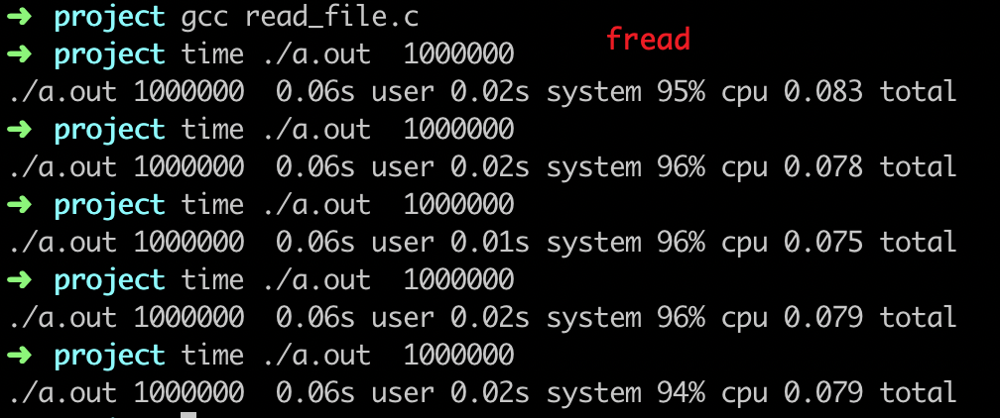
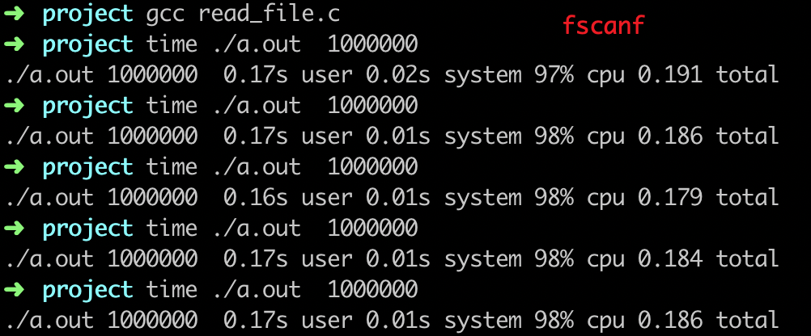

# function call about file 

## TASK1

比较 string / char 的效率

见 compare_string_char.c

## TASK2

比较 write 到 txt 和 bin 的效率和大小

见 write_file.c

## TASK3

比较 read txt 和 bin 的效率和大小

见 read_file.c

