# C functions for process 

- pid: process identifier
- fork: a function that duplicate a process
- exec*: a function that replace a process
- signal: handle unexpected situations 
- pipe: Inter-process Communication 
- wait() / waitpid()

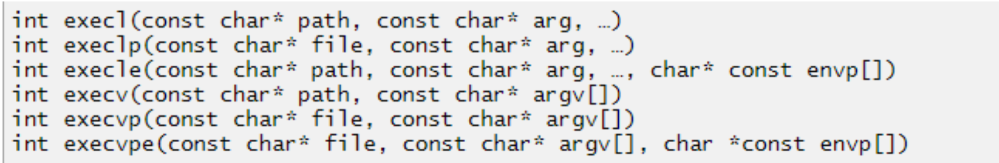

* path: e.g. “/home/zsq/os/example”, “./example”
* file: e.g. ”example”
* argv[]: e.g. array[] = {“/bin/ls”, ”-l“, NULL}; execv(”/bin/ls“,array);
* const char* arg: e.g. execl(”/bin/ls“, “/bin/ls”, ”-l“, NULL);
* envp: e.g. char *e[] = {“USER=zsq”,”HOME=/home/zsq/os”,NULL} 
* 以上函数都基于同一个系统调用：execve() 

根据上图对于`exec`家族的描述，l字辈和v字辈的区别就是后者把执行文件的参数打包成一个数组；p字辈和不带p的区别在于前者从`PATH`环境变量中查找文件执行；而带有`e`的函数会将给定的环境变量传递给需要替换的进程。

## fork.c
`fork()` + `exec*()` + `wait()`

首先父进程通过`fork()`产生子进程，子进程执行`execvp()`中指定的文件，父进程通过`waitpid(pid,NULL,0)`等待改子进程结束。

💡通过这种机制，可以保证父进程在子进程之后执行，那有没有方法能保证子进程在父进程之后执行？

最终的结果如下：

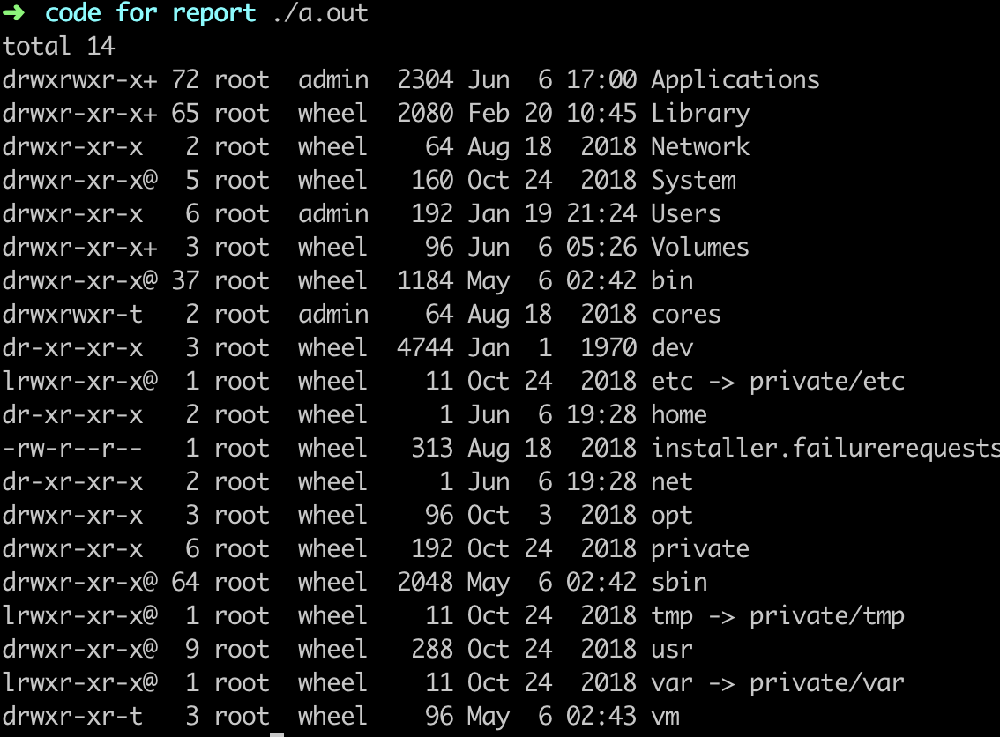


## sys.c
```C
system( "ls -l /bin" );
```
更加简单粗暴的执行命令的方式

```C
# include<stdlib.h>
int system(const char * string);
```

`system()`会调用`fork()`产生子进程，由子进程来调用`/bin/sh-c string`来执行参数string字符串所代表的命令，此命令执行完后随即返回原调用的进程。在调用`system()`期间SIGCHLD 信号会被暂时搁置，SIGINT和SIGQUIT 信号则会被忽略。


## Signals
A kind of interrupt to the running process which play a really important role in switching process states.

例如：`signal(SIGINT, my_handler)` will let the process run function `my_handler` when reveived signal `SIGINT`.

**Kill**

* Send signals to process 这里不是杀死进程的意思！
  * Ctrl+Z: SIGTSTP
  * Ctrl+C: SIGINT


## signal.c

懒癌无法拯救，copy报告了

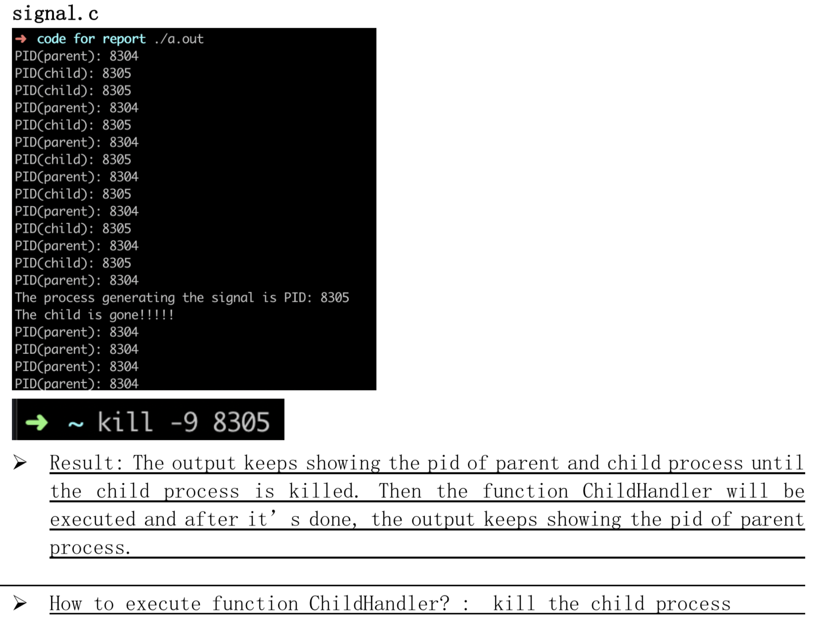


## pipe

Pipe is a communication mechanism for sending information between processes.

System call `pipe`

- File descriptor: an abstract indicator (handle) used to access a file or other input/output resource.
- `pipe(int fd[2])` will create a pipe.
  - `fd[0]`: file descriptor for the read end of pipe 
  - `fd[1]`: file descriptor for the write end of pipe 

管道是在内存中实现的，等同于以下命令：

```shell
$ ls -l /etc/ > temp
$ more < temp
$ rm temp
```

3条命令+1个文件，含有磁盘的IO操作，执行效率没有 pipe 高

## pipe.c

**文件中 dup2()的含义**

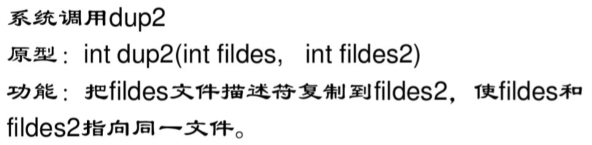

来自 <https://www.linuxquestions.org/questions/showthread.php?p=2931140#post2931140>

1. In Unix and Linux, each file you open gets a consecutively numbered file descriptor. The first three descriptors come automatically when the program is created: "stdin" is "0", "stdout" is "1", and "stderr" is "2". The first file or socket you open after that will be "3", and so on.

2. The way I/O redirection works is to *close* some file (e.g. "stdin") and *open* another file. The new file will get the old number.
3. "dup()" lets you "clone" an existing descriptor. "dup2()" saves you the trouble of doing a separate "close()" (the "close" and "open" become part of the same, atomic action.
4. Here's a link that might make it all a bit clearer (look down in the presentation for item #3: I/O redirection):  [http://www.comp.nus.edu.sg/~cs2281/2...ls9.colour.pdf](http://www.comp.nus.edu.sg/~cs2281/2006-semesterII/foils9.colour.pdf)


**shell中用管道结合两种命令**

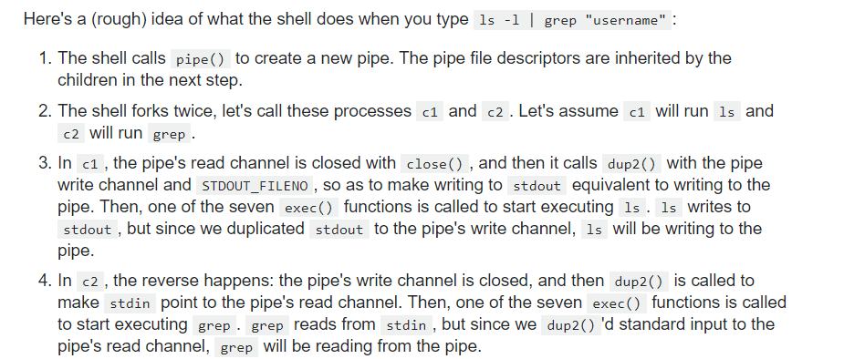

**对该程序的理解**

1. 子进程会关闭管道的读描述符，同时把管道的写描述符复制到标准输出，所以之后本该是`ls`标准输出，都会写入管道中

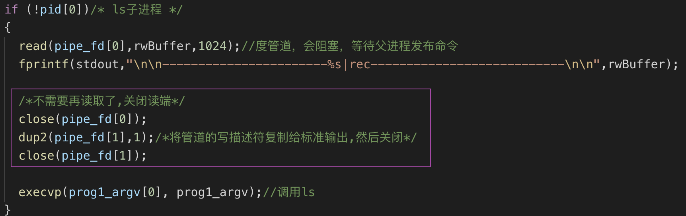

2. 父进程还会再创建新的子进程，这个子进程会关闭管道的写描述符，同时把管道的读描述符复制到标准输入，这样只要管道是有内容的，这些内容就会被传递给`more`指令，作为它的参数。

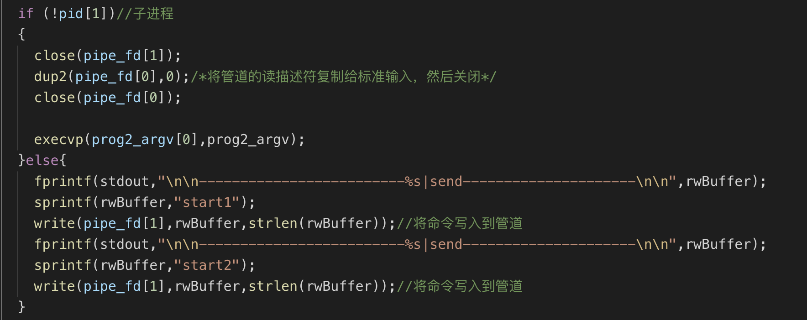

**最终结果**

噗。。这渣画质 从报告里copy下来的，很糊原因未知。为了这个图我都快崩溃了，还记得那次作业是在KFC做的，各种不对，老师给的源代码是有问题的，很多进程间的执行顺序没有解决，导致在我的各种机器上跑出来效果都不对。

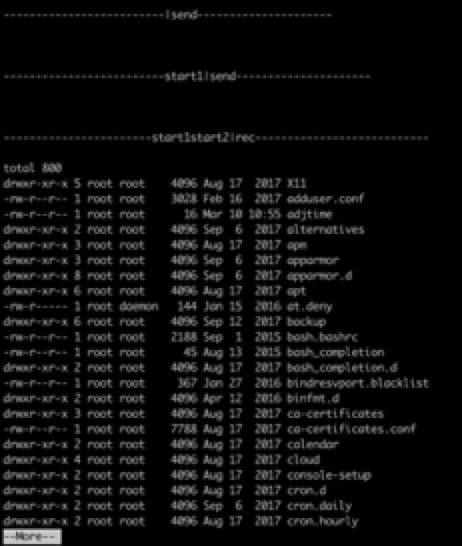

## pipe2.c

问题

As you know, if we want to do inter-process communication, we need at least two processes. Write a program that call fork() to generate a child process, and use pipe() to create a pipe between them. And then, you should input message in one of the process and display the message in the other process.

解决 

<pipe2.c> 非常巧妙的父子进程通信机制，在一个进程通过信号调用hander的时候发出另一个信号传递给另一个进程。

结果如下

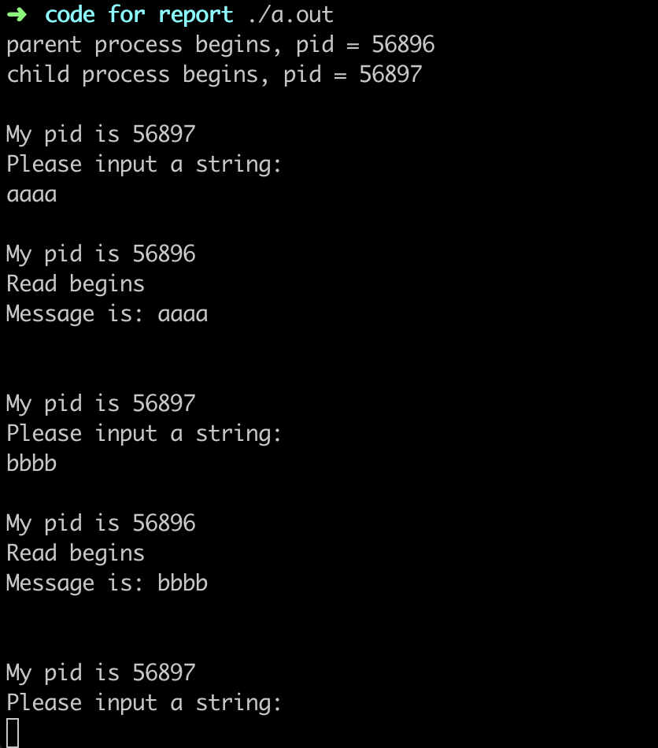


## process.c

当用户登录操作系统以后，操作系统为**会话**（session）分配一个**终端**。会话是指进程运行的环境，即与进程相关的控制终端。shell 被分配到前台的进程组中。**进程组**是指若干个相关进程的集合一一它们通常是通过**管道**连接的。一个终端至多能与一个进程组相关联。前台进程组是会话中能够访问控制终端的进程组。<u>因为每个会话只有一个控制终端，所以只存在一个前台进程组。</u>

前台进程组中的进程可以访问标准输入和标准输出。这也意味着组合键会使控制终端把产生的信号发送给前台进程组中的所有进程；在 Ctrl+C 的操作下信号 SIGINT 会发送给前台的每一个进程；在 Crt+Z 的操作下信号 SIGTSTP 会发送给前台的每一个进程。

同时还存在着后台进程组，它们不能访问会话中控制终端的进程组。因为它不能访问控制终端,所以不能进行终端的I/O操作。如果一个后台进程组试图与控制终端交互，则产生 SIGTTOU 或者 SIGTTIN 信号。默认情况下，这些信号像 SIGT, STP 一样会挂起进程。ysh 必须处理其子进程中发生的这些变化

进程可以使用函数 `setpgid`，使其加入到某一进程组中。进程组 D 是以组长的进程 D 命名的。进程组长是创建该组的第一个进程，用它的进程号作为进程组的组号。进程组长死后进程组仍然可以存在。

进程组可以使用函数 `tcsetpgrp` 成为前台进程组。这个函数调用使指定的进程组成为前台进程组，这不仅会影响到组本身也会影响到该组的任何一个子进程。

如果进程调用函数 `setsid` 创建了一个新的会话，那么它就成为了会话组长和进程组组长。对于一个要与终端交互的新会话来说，必须为它分配一个新的终端。由于是在系统 shell (csh、sh、bash 等）下执行 ysh，这会使 ysh 代替原来的 shell 成为前台进程组中的唯一进程。

让某个进程组成为前台进程组，不仅保证它能够与控制终端保持联系，还保证了前台进程组中的每一个进程都能从终端接收到控制信号，如 SIGTSTP。简单的方法是，把所有的子进程放在同一个进程组中，在创建它们时屏蔽 SIGTSTP 信号，这样只有 shell 才能接收到这个信号，然后 shell 发出与 SIGTSTP 作用相同的（但没有屏蔽的）SIGSTOP 信号给某个子进程。这种办法在某些时候会使程序运行失败，比如在自己的 ysh 中再次运行 ysh，但这种办法对于本实验来说是不涉及的。


使用命令 `ps ajx` 可以查看会话的前台进程组，位于 TGPID 一栏，如果该值为 -1，表示该进程没有控制终端，所以也没有前台进程组。

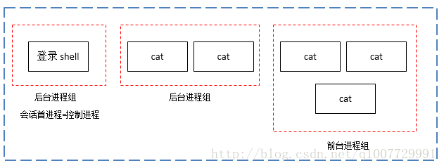

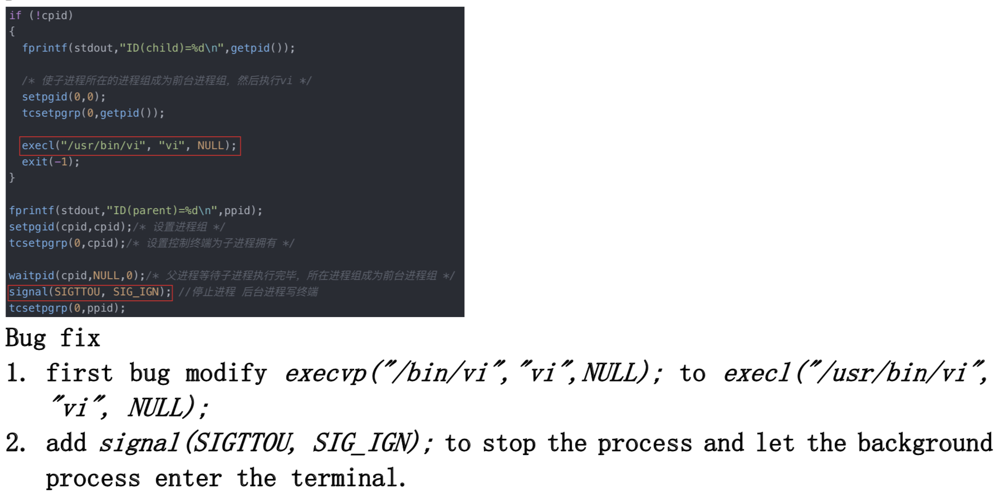

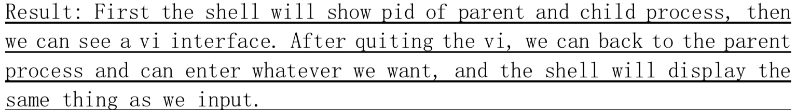


## 未解之谜

上课讨论的玄学问题：

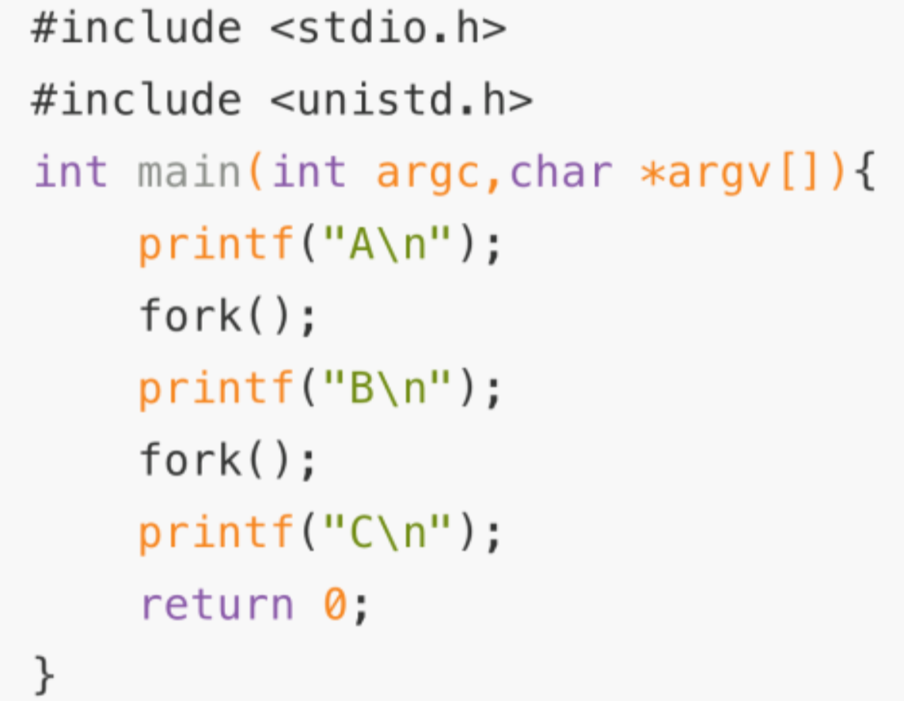

关于这段代码的输出，如果不带`\n`可能会有多种结果，应该是buffer的问题，但多次尝试的结果千奇百怪，没办法说通自己。也许有的进程会提前终止，因为父进程终止了？或者像老师猜测的bash显示问题，已经写出来但是被覆盖了？
