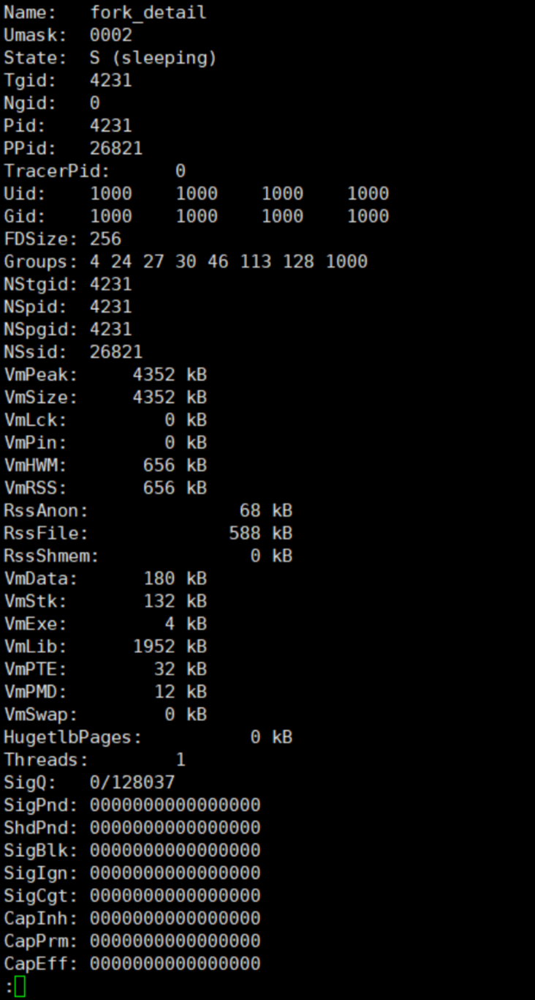
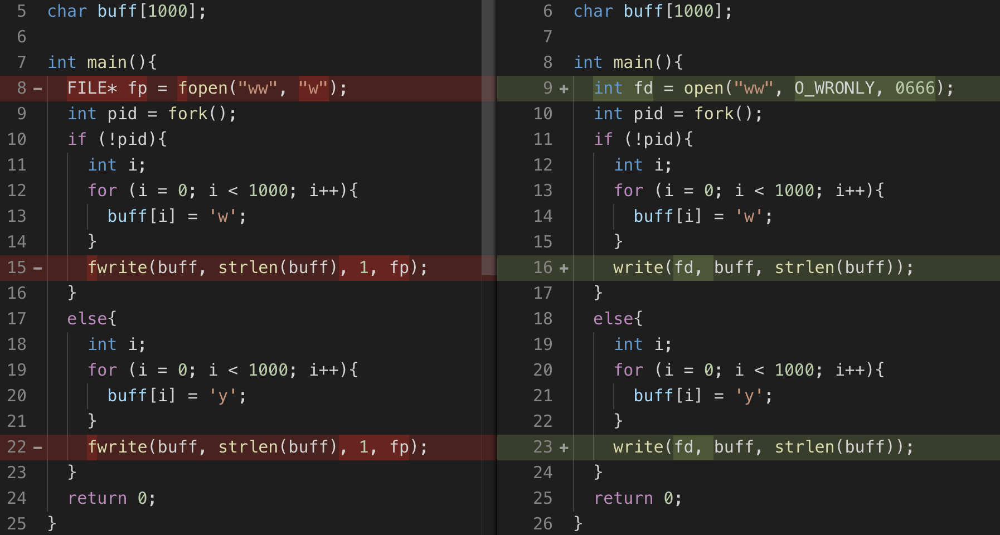
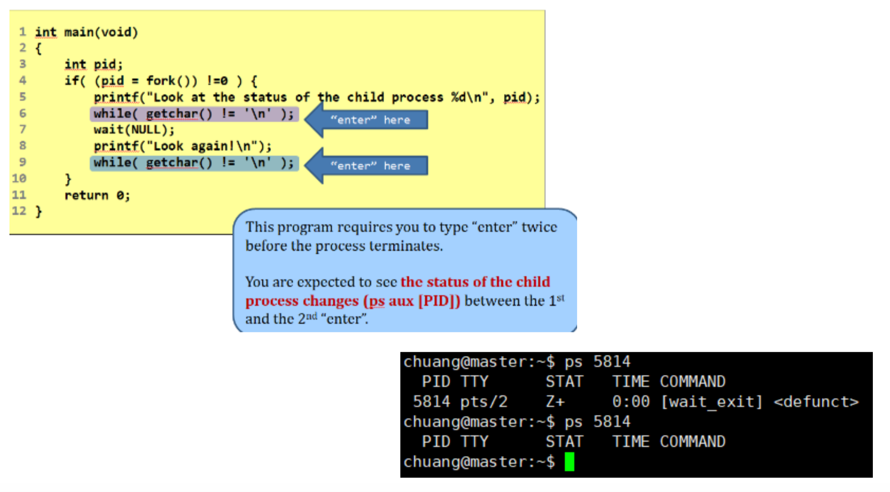
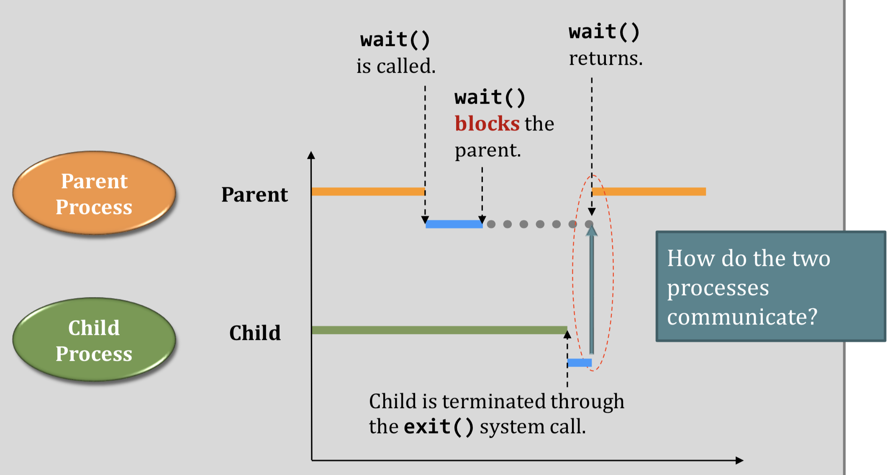

# C functions for process2

## 查看进程的状态

实际上是这样的⬇️

结果

## fork_exec.c

和 `fork_exec2.c` 一样，都实现了模拟 system() 函数的方法。相比之下，后者更加严密，加入了 wait(NULL) 使得父进程不会早于子进程退出。

## Write to same file

O_RDONLY: Open for reading only. O_WRONLY: Open for writing only.

用例说明 write and fwrite 都能锁定正在读写的文件，其他人无法访问

##  wait_exit.c

想了好一会没搞明白这里的深意，原来这是 `wait()` 的知识点。

从下图可以看出，子进程结束后不是立刻就终结的，它需要等待父进程 wait() 的返回值

## time_example.c

这一系列代码是在比较 system time 和 user time

## mq_read.c && mq_write.c

采用 message queue 进行进程间通信的范例

