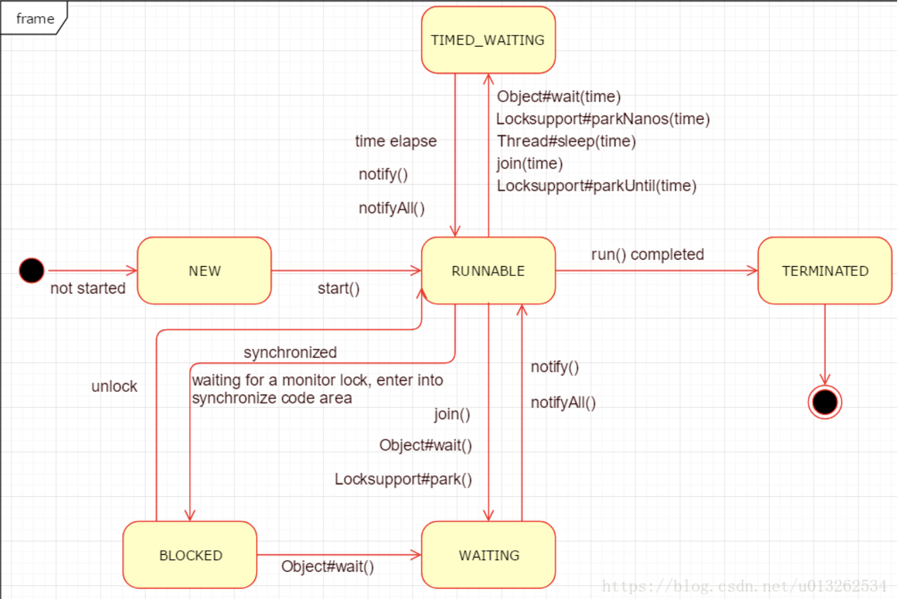

## Thread libraries

主要有三个：

* POSIX Pthread
* Windows thread
* Java thread

### POSIX Pthread


#### 如何使用

```C
# include <pthread.h>

int pthread_create(pthread_t * thread, pthread_attr_t * attr, void * (*start_routine)(void *), void * arg);

// terminated reason: 1. work done 2. invoke pthread_exit 3. invoke pthread_cancel
// 4. exec() or exit() 5. main() finishes
// NOTE:  the pthread_exit() routine does not close files; any files opened inside the thread will remain open after the thread is terminated.
void pthread_exit(void *retval);

int pthread_cancel(pthread_t thread);

int pthread_join(pthread_t th, void **thread_return);

int pthread_detach(pthread_t tid);
```

thread 个数限制可通过 `ulimit `命令修改

 **Thread Attributes**

- pthread_attr_init 和 pthread_attr_destroy
- Detached or joinable state 
- Scheduling inheritance / Scheduling policy / Scheduling parameters / Scheduling contention scope / 
- Stack size / Stack address / Stack guard (overflow) size

**Stack Management**

```C
pthread_attr_getstacksize (attr, stacksize)
pthread_attr_setstacksize (attr, stacksize)

pthread_attr_getstackaddr (attr, stackaddr)

pthread_attr_setstackaddr (attr, stackaddr)
```

thread's stack的大小不是由POSIX standard决定的，超过stack size限制，要么会 program termination，要么会 corrupted data；所以我们最好自己设定栈的大小。

--参考引用3，写的真心详细，**Mutex Variables**这部分还没看到，正好是下个lab的内容--

### Windows thread

参考官方说明 <https://docs.microsoft.com/en-us/windows/desktop/procthread/processes-and-threads>

或参考 <https://blog.csdn.net/qq_41498261/article/details/83618499>

###Java thread

注：以下内容大部分来自引用2

> Java则提供了在不同硬件和操作系统下对线程的统一处理，Thread类则是Java中线程的实现。

#### 实现方式

> 使用操作系统的内核线程实现，内核线程（Kernel-Level Thread, KLT）是直接由kernel支持的线程，这种线程由kernel来完成线程切换，kernel通过scheduler对线程进行调度，并负责将线程的任务映射到各个处理器上。每个内核线程可以视为内核的一个分身，这样操作系统就有能力同时处理多件事情，支持多线程的内核就叫做多线程内核（Muti-Threads Kernel)。

使用Java代码创建线程，调用`Thread.start()`的时候，都是通过LWP接口创建了KLT内核线程，然后通过OS的Thread Scheduler对内核线程进行调度分配CPU。


可以从图中看出**每一个内核线程都是独立的轻量级进程**，所以线程间相互独立，但是需要系统调度开销会很大；每个线程都有自己独立的工作内存，无法访问其它线程的工作内存，同时也不能直接读写main memory中的变量。

#### 如何使用

线程状态转换图



**创建线程**

1. 继承 Thread 类， 重写run()方法
2. 实现 Runnable 接口，实现run()方法
3. 实现 Callable 接口，实现call()方法

**启动线程**

start() 系统开启新进程，并为之分配资源

run() 无需调用，但新进程获得了CPU时间，会自动执行run中的方法，所以创建进程时需要自定义好run方法

**sleep()**

线程交出CPU，让其它程序执行，但不会释放锁

**yield()**

线程交出CPU，重新加到ready list，不会释放锁

**join()**

在主函数中调用，会等待所有线程执行完毕；还可以设置时间参数，等待一定时间

**interrupt()**

中断当前线程的执行

**其它方法**

getId() / getPriority() /setPriority() / setDaemon() / isDaemon() / currentThread()


## OpenMP

仅记录，很多东西未搞明白？

> An Application Program Interface (API) that may be used to explicitly direct **multi-threaded, shared memory** parallelism.
>
> **编译器**根据程序中添加的pragma指令，自动将程序并行处理，使用OpenMP降低了并行编程的难度和复杂度。当编译器不支持OpenMP时，程序会退化成普通（串行）程序。程序中已有的OpenMP指令不会影响程序的正常编译运行。


### 编程模型

分叉-合并模型


> **基于编译器指令：** 大多数OpenMP的并行化都是通过在C/C++或者Fortran中嵌入编译器指令而实现的。
>
> **嵌套并行：** 1）API运行在并行区域内再次嵌入并行区域；2）软硬件实现中可能支持，也可能不支持此功能。
>
> **动态线程：** 1）API也提供了运行时环境，来动态更改用于执行并行区域的线程数，在有可能的情况下尽可能地有效利用已有资源；2）软硬件实现中可能支持，也可能不支持此功能。
>
> **输入输出 (I/O)：** 1）OpenMP没有对并行I/O做出规定，所以对于多个线程尝试读写同一个文件的情况要特别小心；2）但如果每个线程对不同的文件进行I/O操作，则问题并不重要；3）编程者有完全责任确保I/O在多线程中被正确地执行。
>
> **内存模型：频繁更新（flush）？** 1）OpenMP在线程内存中提供了一种“松弛一致性”（relaxed-consistency）和“临时视图”（temporary view）。那就是说，线程可以“缓存”它们的数据，而不必要在任何时刻都保持内存数据的实时精确一致性；2）在所有线程都查看共享变量的关键时刻，编程者需要确保所有所有线程都根据需要更新了共享数据。3）更多关于这个……

### 编译器指令 Compiler Directives

格式：**#pragma omp 指令[子句[,子句] …]**

**指令**

> critical：用在一段代码临界区之前，保证每次只有一个OpenMP线程进入；
> flush：保证各个OpenMP线程的数据影像的一致性；
> barrier：用于并行域内代码的线程同步，线程执行到barrier时要停下等待，直到所有线程都执行到barrier时才继续往下执行；
> atomic：用于指定一个数据操作需要原子性地完成；
> master：用于指定一段代码由主线程执行；
> threadprivate：用于指定一个或多个变量是线程专用，后面会解释线程专有和私有的区别。

**子句**

```C
#pragma omp parallel [clause ...]  newline 
                     if (scalar_expression) 
                     private (list) // 每个线程私有变量
                     shared (list) // 每个线程共享变量
                     default (shared | none) // 用来指定并行域内的变量的使用方式，缺省是shared
                     firstprivate (list)  // 每个线程私有变量，且继承主线程同名变量值
                     lastprivate (list)  // 每个线程私有变量，且最后一个线程拷贝它的值到主线程同名变量值
                     reduction (operator: list) // 用来指定一个或多个变量是私有的，并且在并行处理结束后这些变量要执行指定的归约运算，并将结果返回给主线程同名变量
                     copyin (list) // 指定一个private类型的变量需要用主线程同名变量进行初始化
                     num_threads (integer-expression)


   structured_block
```


```c
#pragma omp for [clause ...]  newline 
                schedule (type [,chunk]) // 指定for任务分担中的任务分配调度类型
                ordered // 用来指定for任务分担域内指定代码段需要按照串行循环次序执行
                private (list) 
                firstprivate (list) 
                lastprivate (list) 
                shared (list) 
                reduction (operator: list) 
                collapse (n) // 指定嵌套循环中的循环应该被折叠成一个大的迭代空间，并根据SCHEDULE子句进行划分。所有关联循环中的迭代的执行顺序确定了折叠迭代空间中的迭代顺序。
                nowait // 如果指定，那么线程在并行循环结束时不同步

   for_loop
   
#pragma omp sections [clause ...]  newline 
                     private (list) 
                     firstprivate (list) 
                     lastprivate (list) 
                     reduction (operator: list) 
                     nowait
  {
  #pragma omp section   newline 
     structured_block

  #pragma omp section   newline 
     structured_block
  }

// 处理非线程安全的代码部分（如I/O时）可能会很有用
#pragma omp single [clause ...]  newline 
                   private (list) 
                   firstprivate (list) 
                   nowait

     structured_block
```

### 运行时库函数 Runtime Library Routines

```C
int omp_get_num_procs(void)     //当前可用的处理器个数

int omp_get_num_threads(void)  //当前并行区域中的线程个数

int omp_get_thread_num(void)   //返回当前的线程号

int omp_set_num_threads(void)  //设置进入并行区域将要创建的线程个数
  
int omp_get_max_threads(void) // 获取并行域可用的最大线程数目
  
int omp_in_parallel(void) // 确定正在执行的代码段是否是并行的
  
void omp_set_dynamic(int dynamic_threads) // 启用或者禁用可执行并行区域的线程数（由运行时系统）的动态调整
  
int omp_get_dynamic(void) // 确定是否启用了动态线程调整
  
void omp_set_nested(int nested) // 用于启用或者禁用嵌套并行
  
int omp_get_nested (void) // 用于确定嵌套并行是否启用

void omp_set_schedule(omp_sched_t kind, int modifier) //设置用于循环指令运行时的时间调度策略

...
```

### 环境变量 Environment Variables

OMP_SCHEDULE：用于for循环并行化后的调度，它的值就是循环调度的类型；  

OMP_NUM_THREADS：用于设置并行域中的线程数；   

OMP_DYNAMIC：通过设定变量值，来确定是否允许动态设定并行域内的线程数；  

OMP_NESTED：指出是否可以并行嵌套。 


[OpenMP在实际开发中应用多吗？](https://www.zhihu.com/question/22347096/answers/updated) 搜索中无意中看到的，感觉还是仁者见仁，智者见智吧。觉得好的人大多觉得很方便使用，觉得不好的原因大致如下：

 **OpenMP Is Not:** （来自引用6）

- Meant for distributed memory parallel systems (by itself)
- Necessarily implemented identically by all vendors
- Guaranteed to make the most efficient use of shared memory
- Required to check for data dependencies, data conflicts, race conditions, deadlocks, or code sequences that cause a program to be classified as non-conforming
- Designed to handle parallel I/O. The programmer is responsible for synchronizing input and output.


ref：

1. 课程lab
2. <https://blog.csdn.net/u013262534/article/details/81676657>
3. [POSIX Threads Programming](<https://computing.llnl.gov/tutorials/pthreads/>)
4. [linux中pthread_join()与pthread_detach()详解](<https://blog.csdn.net/weibo1230123/article/details/81410241>)
5. <https://blog.csdn.net/dcrmg/article/details/53862448>
6. <https://computing.llnl.gov/tutorials/openMP/#Introduction> [翻译](<https://blog.csdn.net/magicbean2/article/details/75530667>)
7. <https://wdxtub.com/2016/03/20/openmp-guide/>
