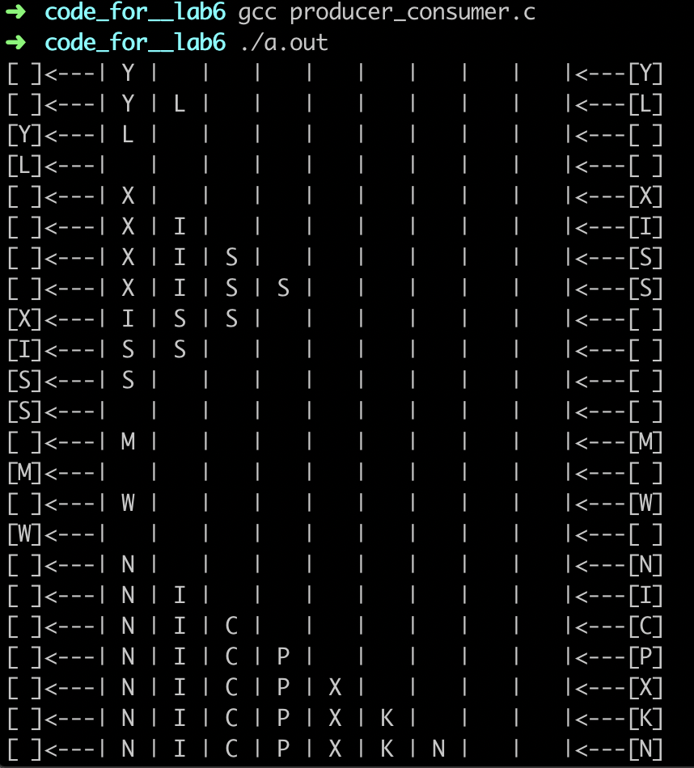
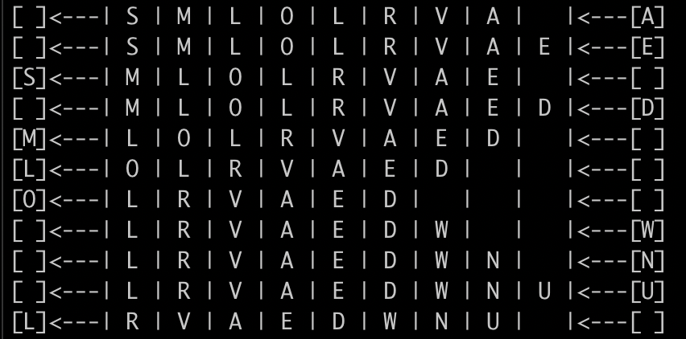

# producer_consumer.c 的理解



左边是消费者，右边是生产者；可以看出每次消费者或生产者执行任务的都是独占的，也就是说只有一个线程在执行。

关于两者的运行顺序，观察下面的代码，不难看出如果当前是生产者执行且buffer是满的，生产者会被阻塞直至消费者执行唤醒生产者，如果当前是消费者执行且buffer是空的，消费者会被阻塞至生产者唤醒消费者；

```C
/* in producer */
if(IS_FULL(head, tail, N))
  pthread_cond_wait(&full, &mutex);	// wait and unlock mutual exclusion.

if(IS_EMPTY(head, tail, N))
  pthread_cond_signal(&empty);		// wake up the consumer.

/* in consumer */
if(IS_EMPTY(head, tail, N))
  pthread_cond_wait(&empty, &mutex);	// wait and unlock mutual exclusion.

if(IS_FULL(head, tail, N))
  pthread_cond_signal(&full);		// wakeup the producer.
```

放个满了的状态图




除此之外，还需注意`pthread_mutex_lock(&mutex);`和 `pthread_mutex_unlock(&mutex);`的位置，当一个线程lock之后另一个线程是无法执行的，直到拥有mutex的线程unlock。